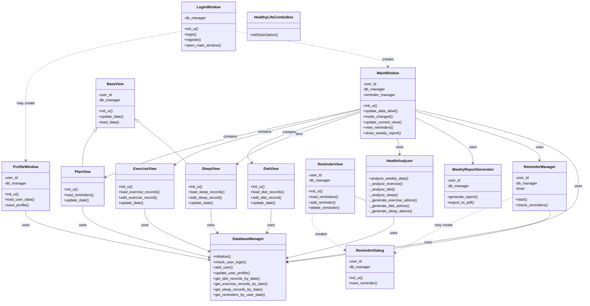

# 设计与运行文档

## 1.运行方法

操作系统：Windows/Linux

环境配置

```bash
cd healthyLife
conda create -n healthy python=3.10
conda activate healthy
pip install -r requirements.txt
```

运行

```bash
python app.py
```


## 2. 设计概述

### 2.1 设计目标

"长期舒适"应用旨在创建一个面向大学生的个人健康管理平台，帮助用户记录、分析和优化其日常饮食、运动和睡眠习惯。本设计文档详细说明了应用的技术实现方案，确保系统的可用性、可靠性和可扩展性。主要设计目标如下：

- **全面的健康数据管理**：构建一个集中式平台，用于管理用户的饮食、运动和睡眠数据。
- **直观的数据可视化**：提供清晰、易懂的图表和统计信息，帮助用户理解其健康状况。
- **个性化健康建议**：基于用户的健康数据和目标，提供个性化的建议和计划。
- **用户友好的界面**：设计简洁、直观的界面，降低用户使用门槛。
- **数据安全与隐私保护**：确保用户健康数据的安全存储和传输，保护用户隐私。

### 2.2 技术栈

基于项目需求和设计原则，我们选择了以下技术栈：

- **前端技术**：
  - **PyQt5框架**：选择PyQt5作为GUI开发框架，提供跨平台的桌面应用程序支持。
  - **Matplotlib**：用于数据可视化，生成各类健康数据图表。
  - **Qt Style Sheets (QSS)**：用于自定义界面样式，提升用户视觉体验。
- **后端技术**：
  - **Python**：作为主要开发语言，具有丰富的库支持和较高的开发效率。
  - **SQLite**：轻量级关系型数据库，用于本地数据存储，无需额外的数据库服务器。
- **数据处理与分析**：
  - **NumPy & Pandas**：用于健康数据的处理和分析。
  - **SciPy**：提供科学计算能力，用于复杂的健康指标计算。


## 3. 系统架构与模块划分

项目的简化UML图如下：


"长期舒适"应用采用分层架构设计，将系统划分为**表示层、业务逻辑层和数据访问层**，以实现关注点分离和职责明确。此架构有利于系统的可维护性、可测试性和可扩展性。

### 3.1 模块划分

基于系统的功能需求和总体架构，我们将应用划分为以下主要模块：

#### 核心模块
- **应用核心(app.py)**：应用程序的入口点，负责初始化和协调其他模块。
- **配置管理**：加载和管理应用配置，支持不同环境的配置切换。

#### 用户界面模块
- **登录界面(login.py)**：用户认证入口，提供登录和注册功能。
- **主窗口(main_window.py)**：应用的主界面，整合所有功能模块。
- **饮食管理界面(diet_*.py)**：录入和查看饮食数据的界面组件。
- **运动管理界面(exercise_*.py)**：录入和查看运动数据的界面组件。
- **睡眠管理界面(sleep_*.py)**：录入和查看睡眠数据的界面组件。
- **健康报告界面**：显示健康分析报告和建议的界面。
- **提醒管理界面(reminder.py)**：设置和管理提醒的界面。
- **自定义组件(custom_widgets.py)**：通用的UI组件，提高代码复用率。

#### 业务逻辑模块
- **用户管理**：处理用户认证和授权，管理用户配置文件。
- **饮食管理**：处理饮食记录的添加、修改、删除和查询。
- **运动管理**：处理运动记录的添加、修改、删除和查询。
- **睡眠管理**：处理睡眠记录的添加、修改、删除和查询。
- **健康分析(health_analyzer.py)**：分析健康数据，生成健康趋势和建议。
- **报告生成(report_generator.py)**：创建可视化报告，支持导出功能。
- **提醒服务**：管理提醒任务，触发通知。

#### 数据访问模块
- **数据库管理器(db_manager.py)**：提供数据库连接和操作接口。
- **数据模型**：定义数据结构和关系，映射到数据库表。
- **数据访问对象**：提供特定领域对象的CRUD操作。

### 3.2  模块间交互

模块之间通过明确的接口和数据流进行交互，以确保松耦合和高内聚。主要交互流程如下：

#### 用户身份验证流程
1. 用户通过登录界面输入凭证
2. 登录界面将凭证传递给用户管理服务
3. 用户管理服务通过数据访问层验证凭证
4. 验证结果返回给登录界面
5. 成功登录后，主窗口被初始化，用户信息被加载

#### 健康数据记录流程
1. 用户通过相应界面输入健康数据（饮食、运动、睡眠）
2. 界面组件调用业务逻辑服务进行数据验证和处理
3. 业务逻辑服务通过数据访问层将数据保存到数据库
4. 操作结果反馈给用户界面

#### 健康分析和报告生成流程
1. 用户通过主窗口请求健康分析或报告
2. 请求传递给健康分析服务或报告生成服务
3. 服务通过数据访问层检索所需健康数据
4. 服务处理和分析数据，生成结果或报告
5. 结果返回给界面显示给用户

#### 提醒通知流程
1. 提醒服务监控计划的提醒时间
2. 当到达提醒时间，提醒服务触发通知
3. 通知通过界面组件显示给用户
4. 用户与通知交互后，结果返回给提醒服务更新提醒状态

## 3. 数据库设计

### 3.1 E-R图


### 3.2 数据库表结构

#### 3.2.1 用户表 (users)

存储用户基本信息和认证数据。

| 字段名 | 数据类型 | 约束 | 说明 |
|-------|---------|------|------|
| user_id | INTEGER | PRIMARY KEY, AUTOINCREMENT | 用户唯一标识 |
| username | TEXT | NOT NULL, UNIQUE | 用户名 |
| password_hash | TEXT | NOT NULL | 密码哈希 |
| salt | TEXT | NOT NULL | 密码盐值 |
| email | TEXT | UNIQUE | 电子邮件 |
| full_name | TEXT | | 用户全名 |
| gender | TEXT | | 性别 |
| birth_date | DATE | | 出生日期 |
| height | REAL | | 身高(cm) |
| weight | REAL | | 体重(kg) |
| activity_level | TEXT | | 活动水平 |
| goal | TEXT | | 健康目标 |
| created_at | DATETIME | NOT NULL | 创建时间 |
| updated_at | DATETIME | NOT NULL | 更新时间 |
| last_login | DATETIME | | 最后登录时间 |
| theme_preference | TEXT | | 主题偏好 |
| notification_preference | TEXT | | 通知偏好 |

#### 3.2.2 饮食记录表 (diet_records)

记录用户的饮食情况，包括食物、分量、热量等信息。

| 字段名 | 数据类型 | 约束 | 说明 |
|-------|---------|------|------|
| record_id | INTEGER | PRIMARY KEY, AUTOINCREMENT | 记录唯一标识 |
| user_id | INTEGER | NOT NULL, FOREIGN KEY | 关联用户ID |
| date | DATE | NOT NULL | 记录日期 |
| meal_type | TEXT | NOT NULL | 餐类型(早餐/午餐/晚餐/加餐) |
| food_id | INTEGER | FOREIGN KEY | 关联食物ID |
| food_name | TEXT | NOT NULL | 食物名称 |
| quantity | REAL | NOT NULL | 食物分量 |
| unit | TEXT | NOT NULL | 计量单位 |
| calories | REAL | NOT NULL | 摄入热量(kcal) |
| protein | REAL | | 蛋白质含量(g) |
| fat | REAL | | 脂肪含量(g) |
| carbohydrates | REAL | | 碳水化合物含量(g) |
| fiber | REAL | | 纤维含量(g) |
| water | REAL | | 水分含量(ml) |
| notes | TEXT | | 备注 |
| created_at | DATETIME | NOT NULL | 创建时间 |
| updated_at | DATETIME | NOT NULL | 更新时间 |

#### 3.2.3 运动记录表 (exercise_records)

记录用户的运动情况，包括运动类型、时长、消耗热量等信息。

| 字段名 | 数据类型 | 约束 | 说明 |
|-------|---------|------|------|
| record_id | INTEGER | PRIMARY KEY, AUTOINCREMENT | 记录唯一标识 |
| user_id | INTEGER | NOT NULL, FOREIGN KEY | 关联用户ID |
| date | DATE | NOT NULL | 记录日期 |
| exercise_id | INTEGER | FOREIGN KEY | 关联运动类型ID |
| exercise_name | TEXT | NOT NULL | 运动名称 |
| duration | INTEGER | NOT NULL | 运动时长(分钟) |
| intensity | TEXT | | 运动强度(低/中/高) |
| calories_burned | REAL | | 消耗热量(kcal) |
| distance | REAL | | 运动距离(km) |
| heart_rate | INTEGER | | 平均心率 |
| notes | TEXT | | 备注 |
| created_at | DATETIME | NOT NULL | 创建时间 |
| updated_at | DATETIME | NOT NULL | 更新时间 |

#### 3.2.4 睡眠记录表 (sleep_records)

记录用户的睡眠情况，包括睡眠时间、质量等信息。

| 字段名 | 数据类型 | 约束 | 说明 |
|-------|---------|------|------|
| record_id | INTEGER | PRIMARY KEY, AUTOINCREMENT | 记录唯一标识 |
| user_id | INTEGER | NOT NULL, FOREIGN KEY | 关联用户ID |
| date | DATE | NOT NULL | 记录日期 |
| sleep_time | DATETIME | NOT NULL | 入睡时间 |
| wake_time | DATETIME | NOT NULL | 醒来时间 |
| duration | INTEGER | NOT NULL | 睡眠时长(分钟) |
| quality | INTEGER | | 睡眠质量(1-5) |
| interruptions | INTEGER | | 中断次数 |
| factors | TEXT | | 影响因素 |
| notes | TEXT | | 备注 |
| created_at | DATETIME | NOT NULL | 创建时间 |
| updated_at | DATETIME | NOT NULL | 更新时间 |

#### 3.2.5 食物信息表 (foods)

存储食物的基本信息和营养成分。

| 字段名 | 数据类型 | 约束 | 说明 |
|-------|---------|------|------|
| food_id | INTEGER | PRIMARY KEY, AUTOINCREMENT | 食物唯一标识 |
| name | TEXT | NOT NULL | 食物名称 |
| category | TEXT | | 食物类别 |
| calories_per_unit | REAL | NOT NULL | 单位热量(kcal) |
| protein_per_unit | REAL | | 单位蛋白质含量(g) |
| fat_per_unit | REAL | | 单位脂肪含量(g) |
| carbs_per_unit | REAL | | 单位碳水化合物含量(g) |
| fiber_per_unit | REAL | | 单位纤维含量(g) |
| default_unit | TEXT | NOT NULL | 默认计量单位 |
| description | TEXT | | 食物描述 |
| image_path | TEXT | | 食物图片路径 |
| is_custom | BOOLEAN | NOT NULL DEFAULT 0 | 是否用户自定义 |
| user_id | INTEGER | FOREIGN KEY | 创建该食物的用户ID |
| created_at | DATETIME | NOT NULL | 创建时间 |
| updated_at | DATETIME | NOT NULL | 更新时间 |

#### 3.2.6 运动信息表 (exercises)

存储运动类型和相关信息。

| 字段名 | 数据类型 | 约束 | 说明 |
|-------|---------|------|------|
| exercise_id | INTEGER | PRIMARY KEY, AUTOINCREMENT | 运动唯一标识 |
| name | TEXT | NOT NULL | 运动名称 |
| category | TEXT | | 运动类别 |
| calories_per_minute | REAL | | 每分钟消耗热量(kcal) |
| description | TEXT | | 运动描述 |
| image_path | TEXT | | 运动图片路径 |
| is_custom | BOOLEAN | NOT NULL DEFAULT 0 | 是否用户自定义 |
| user_id | INTEGER | FOREIGN KEY | 创建该运动的用户ID |
| created_at | DATETIME | NOT NULL | 创建时间 |
| updated_at | DATETIME | NOT NULL | 更新时间 |

#### 3.2.7 提醒事项表 (reminders)

存储用户设置的提醒，例如饮水、服药、运动提醒等。

| 字段名 | 数据类型 | 约束 | 说明 |
|-------|---------|------|------|
| reminder_id | INTEGER | PRIMARY KEY, AUTOINCREMENT | 提醒唯一标识 |
| user_id | INTEGER | NOT NULL, FOREIGN KEY | 关联用户ID |
| title | TEXT | NOT NULL | 提醒标题 |
| description | TEXT | | 提醒描述 |
| type | TEXT | NOT NULL | 提醒类型(饮食/运动/睡眠/其他) |
| time | TIME | NOT NULL | 提醒时间 |
| days_of_week | TEXT | | 每周重复日(1-7) |
| is_active | BOOLEAN | NOT NULL DEFAULT 1 | 是否激活 |
| created_at | DATETIME | NOT NULL | 创建时间 |
| updated_at | DATETIME | NOT NULL | 更新时间 |
| last_triggered | DATETIME | | 最后触发时间 |

### 3.3 数据访问层设计

数据访问层提供统一的接口，用于业务逻辑层与数据库之间的交互。主要设计如下：

#### 数据库连接管理

通过 `db_manager.py` 实现数据库连接池和会话管理，确保高效、安全的数据库访问：

```python
class DatabaseManager:
    def __init__(self, db_path):
        """初始化数据库管理器"""
        self.db_path = db_path
        self.connection = None
        
    def connect(self):
        """建立数据库连接"""
        # 创建数据库连接并配置
        
    def execute_query(self, query, params=()):
        """执行查询操作"""
        # 执行SQL查询并返回结果
        
    def execute_update(self, query, params=()):
        """执行更新操作"""
        # 执行SQL更新并返回影响行数
        
    def initialize(self):
        """初始化数据库结构"""
        # 创建所需的表和索引
```

#### 数据访问模式

采用 **Data Access Object (DAO) 模式**，为每个主要实体创建专门的访问类：

```python
class UserDAO:
    def __init__(self, db_manager):
        self.db_manager = db_manager
        
    def get_user_by_id(self, user_id):
        """根据ID获取用户"""
        
    def get_user_by_username(self, username):
        """根据用户名获取用户"""
        
    def create_user(self, user_data):
        """创建新用户"""
        
    def update_user(self, user_id, user_data):
        """更新用户信息"""
        
    def delete_user(self, user_id):
        """删除用户"""
```

类似的DAO实现也用于其他实体（饮食记录、运动记录、睡眠记录等）。

## 4. 详细模块设计

本项目分为用户管理、健康生活记录（包括饮食、睡眠、运动）、健康分析、日程提醒几大模块。详细设计如下。


项目有以下几个核心类：




### 4.1 用户管理模块

用户管理模块是应用程序的基础架构，负责用户身份验证、个人资料管理及权限控制。该模块采用分层设计，将UI交互与数据处理逻辑分离，提高系统稳定性和维护性。在安全方面，实现了密码加盐哈希存储和验证码机制，防止暴力破解和账户滥用。用户个人资料支持多维度健康信息采集，为后续健康分析提供数据基础，同时考虑了数据隐私保护机制。

**登录注册功能：**

- `login()`: 执行用户登录验证，采用加盐哈希算法校验密码
- `register()`: 处理新用户注册，创建账户并存储个人信息
- `refresh_captcha()`: 生成随机验证码防止恶意登录

**个人资料管理：**
- `load_user_data()`: 从数据库检索用户个人信息
- `save_profile()`: 更新并保存用户信息到数据库
- 支持字段：性别、年龄、身高、体重、饮食习惯、运动习惯、睡眠习惯

**密码安全机制：**
- 采用SHA-256哈希算法和随机盐值保护密码
- `hash_password()`: 创建安全的密码哈希值
- `verify_password()`: 验证输入密码是否匹配存储的哈希值

### 4.2 健康生活记录模块

健康生活记录模块是应用的核心功能区，集成饮食、运动和睡眠三大健康维度的数据采集与管理。该模块采用统一的数据模型设计，保证各类健康数据的一致性和互操作性，同时针对不同记录类型提供专门优化的界面和功能。模块实现了数据录入、浏览、编辑和删除的全生命周期管理，支持多维度的数据筛选与图表展示，为用户提供直观的健康状况反馈。

#### 饮食管理模块

饮食管理模块由`ui/diet_view.py`和`ui/diet_record.py`构成，集成食物数据库与用户饮食记录功能。

**饮食记录功能：**
- `load_diet_records()`: 加载并显示用户饮食记录，支持按日期和餐食类型筛选
- `add_diet_record()`: 打开记录对话框，添加新的饮食数据
- `edit_diet_record()`: 修改已有饮食记录
- `delete_diet_record()`: 删除选定的饮食记录

**饮食数据分析：**
- `analyze_diet_data()`: 计算每日营养素摄入总量
- 跟踪指标：总热量、蛋白质、脂肪、碳水化合物、膳食纤维
- 数据可视化：通过图表展示饮食构成和营养平衡

**食物数据管理：**
- `load_food_data()`: 从JSON文件加载350+种食物营养信息
- `search_foods()`: 按关键词搜索食物
- `get_foods_by_category()`: 按分类检索食物数据

**营养建议生成：**
- `generate_nutrition_advice()`: 基于用户饮食记录和目标生成个性化建议
- 考虑因素：BMI指数、活动水平、饮食偏好、健康目标

#### 运动管理模块

运动管理模块通过`ui/exercise_view.py`和`ui/exercise_record.py`实现运动记录与分析功能。

**运动记录功能：**
- `load_exercise_records()`: 显示用户运动历史记录
- `add_exercise_record()`: 添加新的运动活动
- `edit_exercise_record()`: 修改已有运动记录
- `delete_exercise_record()`: 删除选定的运动记录

**运动数据分析：**
- `analyze_exercise_data()`: 分析运动量、强度和类型分布
- 计算指标：总消耗热量、运动总时长、平均强度
- 对比WHO推荐标准：每周150分钟中等强度活动

**热量消耗计算：**
- `calculate_calories_burned()`: 基于运动类型、持续时间和用户体重计算热量消耗
- 支持多种运动类型：有氧、力量、柔韧性、球类运动等
- 精确计算：考虑运动强度系数和个人体重差异

**运动建议生成：**
- `generate_exercise_recommendations()`: 生成个性化运动计划建议
- 考虑用户当前习惯、健康状况和目标
- 提供渐进式增加运动量的方案，防止运动伤害

#### 睡眠管理模块

睡眠管理模块由`ui/sleep_record.py`实现，支持睡眠时间记录与质量评估。

**睡眠记录功能：**
- `add_sleep_record()`: 添加新的睡眠记录
- `edit_sleep_record()`: 修改已有睡眠数据
- `load_sleep_records()`: 从数据库加载睡眠历史
- 记录字段：入睡时间、起床时间、睡眠时长、主观质量评分(1-5星)

**睡眠质量分析：**
- `analyze_sleep_quality()`: 评估睡眠模式和质量
- 计算指标：平均睡眠时长、睡眠规律性、质量评分趋势
- 统计视图：睡眠质量趋势图、周平均数据比较

**睡眠数据检索：**
- `get_sleep_records_by_date_range()`: 按日期范围获取睡眠记录
- `get_sleep_statistics()`: 生成睡眠统计数据
- 支持图表可视化：展示睡眠规律与质量变化

**睡眠改善建议：**
- `generate_sleep_advice()`: 基于睡眠分析生成改善建议
- 参考健康标准：成人7-9小时睡眠时长
- 提供改善方案：睡眠环境优化、作息规律建立、放松技巧

### 4.5 健康分析模块

健康分析模块是应用的智能核心，整合多维度健康数据，提供全面的健康状态评估和个性化建议。该模块采用数据挖掘和统计分析方法，从用户饮食、运动和睡眠记录中提取有价值的健康指标，结合医学标准进行对比和评估。系统支持时间序列分析，识别健康状态变化趋势并预警潜在风险。报告生成系统提供多种格式输出，结合数据可视化技术，将复杂的健康信息转化为直观易懂的图表与建议。

健康分析模块由`utils/health_analyzer.py`和`utils/report_generator.py`构成，提供综合健康评估与报告。

**综合健康评估：**
- `analyze_user_health()`: 多维度健康状况评估
- `calculate_bmi()`: 计算体重指数并分类（过轻、正常、过重、肥胖）
- `analyze_energy_balance()`: 分析热量摄入与消耗平衡
- `evaluate_sleep_quality()`: 评估睡眠质量并提供改进建议

**健康趋势分析：**
- `analyze_health_trends()`: 跟踪健康指标变化趋势
- 监测指标：体重变化、运动频率、睡眠模式、饮食结构
- 预测功能：通过线性回归分析预测发展趋势

**饮食结构分析：**
- `analyze_diet_structure()`: 评估营养摄入平衡性
- 计算各营养素占比：蛋白质、脂肪、碳水化合物、微量元素
- 与推荐值对比：基于用户性别、年龄和活动水平

**健康报告生成：**
- `generate_weekly_report()`: 创建全面健康周报
- `_generate_summary_text()`: 生成健康状况摘要
- `_generate_detailed_report()`: 提供详细分析和建议
- `_export_weekly_report_pdf()`: 导出PDF格式报告，支持图表可视化

### 4.6 提醒功能模块

日程提醒模块为用户提供健康行为管理工具，通过定时提醒帮助用户养成良好习惯。该模块使用事件驱动架构，将提醒创建、存储、检查和通知分为独立环节，确保系统资源高效利用。设计中采用后台服务模式，使用QTimer实现周期性检查，并通过信号槽机制与前端UI解耦。提醒系统支持多种提醒方式和用户响应选项，增强交互灵活性，同时通过去重和延迟机制避免重复打扰。提醒功能模块由`ui/reminder.py`和`utils/reminder.py`实现，为用户提供健康活动提醒服务。

**提醒设置功能：**
- `save_reminder()`: 保存新建或编辑的提醒
- `load_reminders()`: 加载用户所有提醒到表格视图
- `edit_reminder()`: 修改现有提醒设置
- `delete_reminder()`: 删除选定的提醒

**提醒触发机制：**
- `ReminderManager`类：管理所有提醒的后台服务
- `start()`: 启动定时检查，默认每30秒一次
- `check_reminders()`: 检查±15分钟内的提醒，计算时差
- 触发条件：当前时间与提醒时间在±10分钟范围内

**提醒状态管理：**
- `active_reminders`字典：防止重复提醒
- `snooze()`: 延迟提醒15分钟
- `mark_reminder_completed()`: 标记提醒为已完成

**通知系统实现：**
- 应用内通知：通过`reminder_triggered`信号和对话框展示
- 系统级通知：使用`plyer`库在应用最小化时发送桌面通知
- 用户交互选项：确认完成、稍后提醒
- `show_reminder()`：显示提醒对话框并处理用户响应

## 5. 项目核心算法

### 5.1 健康数据整合分析

健康分析系统通过`HealthAnalyzer`类实现，将用户的运动、饮食和睡眠三大维度数据进行整合分析。系统采用模块化设计，通过`analyze_weekly_data`方法接收各类健康记录，并分别调用专门的分析函数处理每个维度的数据。分析结果包含各项指标的统计值和针对性建议，以字典形式返回，便于在界面中灵活展示。

### 5.2 运动数据分析算法

运动分析算法通过`_analyze_exercise`方法实现，主要计算以下指标：
- 运动天数占比：衡量用户运动习惯规律性
- 总运动时长与消耗热量：量化运动量
- 平均每日运动时间：评估日常活动水平
- 达标情况：对比WHO推荐的每周150分钟中等强度运动标准

系统根据达标率和运动频率生成针对性建议，对不同运动水平的用户提供渐进式的改进方案。

### 5.3 饮食营养分析算法

饮食分析算法通过`_analyze_diet`方法实现，计算关键营养指标：
- 总热量及蛋白质、脂肪、碳水化合物摄入量
- 宏营养素比例：计算三大营养素的能量占比
- 推荐值对比：基于用户性别、年龄、身高、体重计算个人化推荐值

推荐值计算采用Harris-Benedict公式计算基础代谢率(BMR)，再根据活动水平调整得到每日能量需求。蛋白质推荐量按每公斤体重1.6克计算，脂肪和碳水化合物分别占总热量的30%和55%。

### 5.4 睡眠质量分析算法

睡眠分析算法通过`_analyze_sleep`方法实现，评估以下指标：
- 睡眠记录完整性：记录天数占比
- 平均睡眠时长：总睡眠时间除以记录天数
- 睡眠质量评分：基于用户主观评价的平均值
- 达标情况：与推荐睡眠时间的对比

推荐睡眠时间根据用户年龄动态计算：青少年9小时，成年人8小时，老年人7.5小时，与实际睡眠时长对比评估达标率。

### 5.5 个性化建议生成算法

建议生成算法包含四个专门方法，分别针对运动、饮食、睡眠和综合情况：
- 运动建议：根据达标率和运动频率提供阶梯式改进方案
- 饮食建议：分析热量平衡和营养素比例，建议调整饮食结构
- 睡眠建议：基于时长和质量评分，提供睡眠环境和习惯改进建议
- 综合建议：整合三个维度，确定优先改进方向，设定长期健康目标

建议生成采用规则型算法，根据各指标与标准值的差距，从预设的建议库中选择最相关的内容组合，形成个性化的健康改进计划。

## 6. 项目扩展方向

该项目还有以下几个可以扩展的方向：

- 移动端适配：对于健康应用，桌面端使用远不如移动端方便。
- AI智能分析：该项目目前的健康分析算法简单，后期可以引入AI技术分析（例如接入大模型）。
- 分享系统：例如连接微信，将健康数据分享到朋友圈等
- 云端同步：针对本地数据容易丢失的特点，可以引入云端数据同步功能


